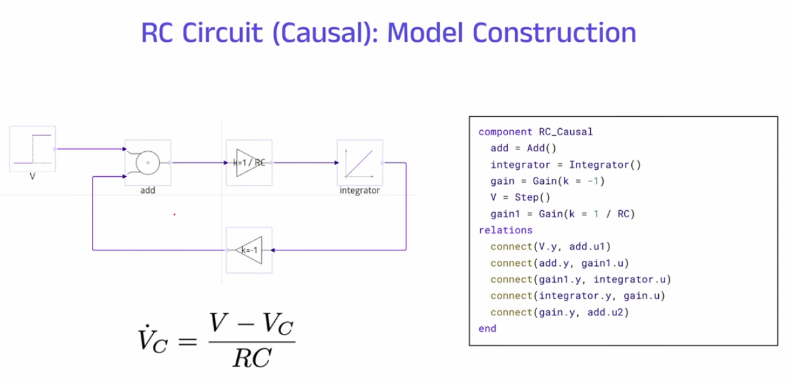
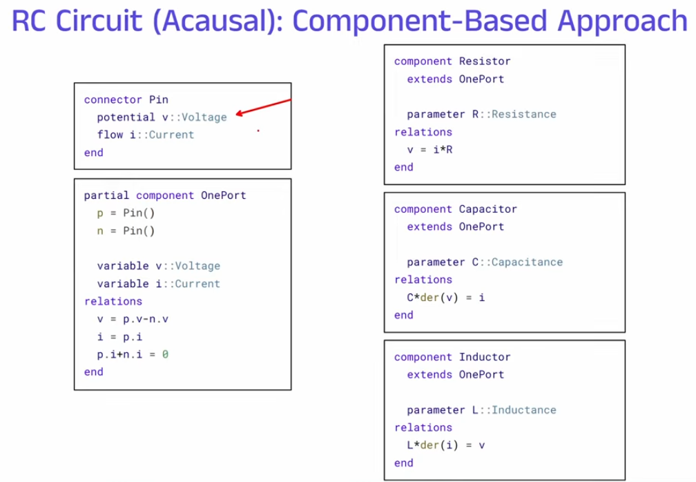
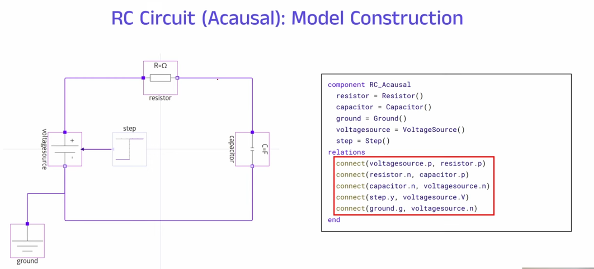

# Julia

## Daftar Isi

- [Install di Ubuntu](#install-di-ubuntu)
- [Add to Jupyter Notebook](#add-to-jupyter-notebook)
- [Update Julia](#update-julia)
- [Causal vs Acausal Modeling](#causal-vs-acausal-modeling)
- [Referensi](#referensi)

## Install di Ubuntu

``` example
   $ sudo apt install julia
```

**Referensi**

-   [julialang.org](https://julialang.org/downloads/platform/)
-   [docs.julialang.org](https://docs.julialang.org/en/v1/manual/getting-started/)

## Add to Jupyter Notebook

``` example
$ julia
$ using Pkg
$ Pkg.add("IJulia")
$ jupyter-notebook
```

## Update Julia

``` example
versioninfo()
using Pkg
Pkg.add("UpdateJulia")
using UpdateJulia
update_julia()
```

**Referensi**

-   [datatofish.com](https://datatofish.com/add-julia-to-jupyter/)

## Causal vs Acausal Modeling







## Referensi

- [How to install julia on
ubuntu](https://ferrolho.github.io/blog/2019-01-26/how-to-install-julia-on-ubuntu)
- [Remove previous version from
Jupyter](https://stackoverflow.com/questions/44914176/how-to-remove-previous-version-from-jupyter/45211705)
- [Add Julia to Jupyter
Notebook](https://datatofish.com/add-julia-to-jupyter/)
- [Add latest Julia version to Jupyter
Notebook](https://stackoverflow.com/questions/65151297/how-to-add-latest-julia-version-to-jupyter-notebook)
- [Update
Julia](https://www.educative.io/answers/how-to-upgrade-julia-to-a-new-release)
- [Causal vs Acausal Modeling](https://www.youtube.com/watch?v=ZYkojUozeC4)